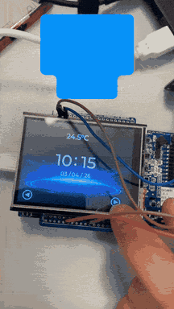

# ⌚ Embedded Smartwatch Based on nRF5340

## 📸 Demonstration

<p align="center">
  
</p>
<p align="center">
  <em>Full smartwatch demonstration — Zephyr RTOS + LVGL interface on nRF5340</em>
</p>

---

## 📌 Project Overview

This project is a fully embedded smartwatch system developed using the **Nordic nRF5340-DK** board.

The system runs on **Zephyr RTOS** and integrates real-time environmental sensing, Bluetooth Low Energy communication, a graphical touchscreen interface, and precise timekeeping via an external RTC module.

This project highlights competencies in:
- Embedded firmware development with Zephyr RTOS
- Sensor interfacing (I2C, SPI)
- Real-time GUI design with LVGL
- Bluetooth Low Energy (BLE) communication
- Real-Time Clock (RTC) management

---

## 🎯 Objectives

- Run a real-time operating system (Zephyr) on nRF5340
- Display a smartwatch interface on a 320×240 touchscreen using LVGL
- Read environmental and motion data from onboard sensors
- Exchange data with a smartphone via Bluetooth Low Energy
- Manage accurate timekeeping with an external RTC module (RV-8263-C8)

---

## 🧠 System Architecture

### 🔧 Main Board

- **Nordic nRF5340-DK**
  - MCU: nRF5340 (dual-core ARM Cortex-M33)
  - App Core @ 128 MHz / Net Core @ 64 MHz (BLE stack)
  - RTOS: Zephyr Project

### 🖥️ Display

- **Adafruit 2.8" TFT Touch Shield v2**
  - Resolution: 320 × 240 pixels
  - Interface: SPI
  - Resistive touchscreen
  - GUI Framework: LVGL + Squareline Studio

### 🌡️ Environmental & Motion Sensors (ST IKS01A3 Shield)

| Measurement                  | Sensor   | Interface |
|------------------------------|----------|-----------|
| Accelerometer & Gyroscope    | LSM6DSO  | I2C       |
| Magnetometer                 | LIS2MDL  | I2C       |
| Temperature & Humidity       | HTS221   | I2C       |
| Barometric Pressure          | LPS22HH  | I2C       |

### 🕐 Real-Time Clock

- **Micro Crystal RV-8263-C8**
  - Interface: I2C
  - Purpose: Accurate date/time tracking independent of MCU

---

## 📁 Project Structure
 
```
Zephyr-Smartwatch-nrf5340/
│
├── boards/                                     # Board-specific configuration files
│   ├── m5stack_core2_procpu.conf
│   ├── mimxrt1170_evk_mimxrt1176_cm7.conf
│   └── nrf5340dk_nrf5340_cpuapp.overlay        # Device tree overlay for nRF5340-DK
│
├── build/                                      # Compiled output (auto-generated by west)
│
├── src/                                        # Application source code
│   ├── All_sensors/                            # Environmental & motion sensor drivers
│   │   ├── sensors.c
│   │   └── sensors.h
│   │
│   ├── BLE/                                    # Bluetooth Low Energy stack & services
│   │   ├── BLE_Configuration.c
│   │   └── BLE_Configuration.h
│   │
│   ├── Chronometer/                            # Stopwatch / chronometer feature
│   │   ├── chrono.c
│   │   └── chrono.h
│   │
│   ├── RTC/                                    # Real-Time Clock management (RV-8263-C8)
│   │   ├── rtc.c
│   │   └── rtc.h
│   │
│   ├── lvgl/                                   # LVGL graphics framework integration
│   │
│   ├── ui/                                     # User interface (generated by Squareline Studio)
│   │   ├── components/                         # Reusable UI components
│   │   ├── images/                             # UI assets & icons
│   │   ├── screens/                            # Individual watch screens
│   │   ├── CMakeLists.txt
│   │   ├── README.md
│   │   ├── filelist.txt
│   │   ├── project.info
│   │   ├── ui.c
│   │   ├── ui.h
│   │   ├── ui_events.h
│   │   ├── ui_helpers.c
│   │   └── ui_helpers.h
│   │
│   └── main.c                                  # Application entry point
│
├── CMakeLists.txt                              # CMake build configuration
├── prj.conf                                    # Zephyr Kconfig configuration
└── Demonstration_Smartwatch_12Mo.gif           # Demo animation
```

---

## 💻 Software & Technologies

- Embedded C
- Zephyr RTOS
- LVGL — Lightweight graphics library
- Squareline Studio — GUI design tool
- Bluetooth Low Energy (BLE)
- I2C / SPI communication protocols
- Devicetree & Overlays
- Kconfig — Kernel configuration
- west — Build & flash toolchain

---

## 📊 Features

### ⌚ Smartwatch Interface
- Real-time clock display (hours, minutes, seconds)
- Date display
- Touch-based navigation between screens

### 🌍 Environmental Monitoring
- Temperature (°C)
- Humidity (%RH)
- Atmospheric pressure (hPa)

### 🏃 Motion Sensing
- Accelerometer data (LSM6DSO)
- Gyroscope data (LSM6DSO)
- Magnetometer / compass (LIS2MDL)

### ⏱️ Chronometer
- Start / Stop / Reset via touchscreen

### 📡 Bluetooth Low Energy
- Data exchange with a paired smartphone
- BLE advertising and connection management

---

## 🚀 Getting Started

### Requirements

- [nRF Connect SDK](https://developer.nordicsemi.com/nRF_Connect_SDK/doc/latest/nrf/installation.html) (includes Zephyr)
- `west` build tool
- J-Link / nRF5340-DK USB connection

### Installation

```bash
git clone https://github.com/etudianthamza/Zephyr-Smartwatch-nrf5340.git
cd Zephyr-Smartwatch-nrf5340
```

1. Install **nRF Connect SDK** and set up `west`
2. Build the project for the nRF5340-DK
3. Connect the board via USB
4. Flash the firmware

```bash
west build -b nrf5340dk_nrf5340_cpuapp
west flash
```
